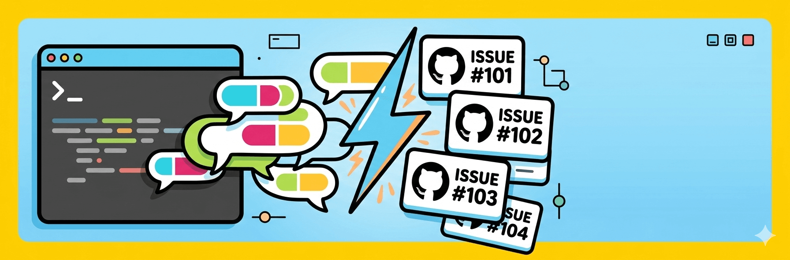

# Slack-Ticket



## Overview

**slack-ticket** is a high-performance CLI tool designed to bridge the gap between Slack communication and GitHub issue tracking. It leverages AI to transform fragmented Slack threads into perfectly structured, actionable GitHub issues, saving QA and Support teams hours of manual documentation every week.

---

## Table of Contents
1. [Installation & Usage](#installation--usage)
   - [Global Package Installation](#1-global-package-installation)
   - [Remote Execution (npx)](#2-remote-execution-pulling-the-codebase)
   - [Local Clone and Build](#3-local-clone-and-build)
2. [Setup Guide](#setup-guide)
3. [Usage Guide](#usage-guide)
4. [Command Reference](#command-reference)
5. [Team Participation & Contribution](#team-participation--contribution)
6. [License](#license)

---

<a name="installation--usage"></a>
## Installation & Usage

Depending on your role and frequency of use, there are three primary ways to interact with the tool. Regardless of the method chosen, you must first complete the [Setup Guide](doc/setup.md) to configure your Slack, GitHub, and AI provider tokens.

<a name="1-global-package-installation"></a>
### 1. Global Package Installation

For users who need to report issues frequently across various projects, installing the package globally is the most efficient method.

*   **No limitations exist regarding accessibility as this method allows you to invoke the `slack-ticket` command from any directory on your system at any time.**
*   **The only limitation of this method is that it requires proper npm permissions and environment configuration to ensure the global binary is correctly mapped to your system's PATH.**

```bash
# Install globally
npm install -g slack-ticket

# Run setup
slack-ticket setup

# Create an issue
slack-ticket create <slack-thread-url>
```

<a name="2-remote-execution-pulling-the-codebase"></a>
### 2. Remote Execution (Pulling the Codebase)

If you only need to use the tool occasionally or want to ensure you are always running the absolute latest version without a permanent footprint, you can pull and execute it directly.

*   **There are no limitations regarding disk space or version management because the tool is fetched and executed in a temporary environment on-the-fly.**
*   **A significant limitation is the requirement for a stable internet connection for every execution as the codebase must be pulled from the registry before it can run.**

```bash
# Execute without installing
npx slack-ticket create <slack-thread-url>
```

<a name="3-local-clone-and-build"></a>
### 3. Local Clone and Build

For advanced users or the development team, cloning the repository provides a local environment for testing and custom builds.

*   **No limitations are present for teams who wish to customize the AI prompts or integration logic to suit their specific internal workflows.**
*   **The limitation of this approach is the requirement to manually manage dependencies and perform a build step whenever the source code is updated.**

```bash
# Clone the repository
git clone https://github.com/elvis-ndubuisi/slack-ticket.git
cd slack-ticket

# Install and build
pnpm install
pnpm build

# Run locally
node dist/cli.js setup
```

---

<a name="setup-guide"></a>
## Setup Guide
Detailed instructions for obtaining API tokens and configuring the tool can be found in the [Setup Guide](doc/setup.md).

<a name="usage-guide"></a>
## Usage Guide
For a deep dive into every command, argument, and option available, refer to the [Usage Guide](doc/usage.md).

---

<a name="command-reference"></a>
## Command Reference

| Command | Description |
| :--- | :--- |
| `setup` | Interactive wizard to configure your tokens and default preferences. |
| `create <url>` | Fetches a Slack thread (up to 3 messages by default) and creates a GitHub issue. |
| `update <#>` | Appends new Slack message content to an existing GitHub issue number. |
| `doctor` | Runs a diagnostic suite to verify your Slack, GitHub, and AI connectivity. |
| `config view` | Displays your current configuration with sensitive tokens safely masked. |
| `learn <path-or-url>` | Learn team workflow rules from a Markdown file or URL. |
| `unlearn` | Remove learned workflows and revert to default behavior. |
| `workflow list` | List learned workflows on this machine. |
| `workflow view <id-or-repo>` | View a learned workflow by ID or repo. |
| `learn` + Project Fields | Supports setting Project v2 fields via `projectFields` in the workflow. |

---

<a name="team-participation--contribution"></a>
## Team Participation & Contribution

### For QA & Support Teams
-   **Use the `doctor` command**: If you encounter issues creating tickets, run `slack-ticket doctor` first to see if a token has expired or permissions have changed.
-   **Leverage Dry Runs**: Use the `--dry-run` flag with the `create` command to see what the AI will generate before it touches GitHub.
-   **Selective Updates**: Use the `update` command to keep issues "alive" as new information arrives in Slack, rather than creating duplicate issues.

### Contributing
We welcome contributions! To streamline our release process, we use [Changesets](https://github.com/changesets/changesets).

**When you submit a PR with a new feature or bug fix:**
1.  Run `pnpm changeset` locally before committing.
2.  Follow the interactive prompts to declare a `patch`, `minor`, or `major` bump and write a quick summary of your change.
3.  Commit the generated `.changeset/*.md` file along with your code.

When your PR merges to `main`, our GitHub Actions CI will automatically parse your changeset, update the `CHANGELOG.md`, increment the version, and publish the new release to npm.

Ensure you have followed the [Setup Guide](doc/setup.md) before starting development.

---

<a name="license"></a>
## License
ISC
